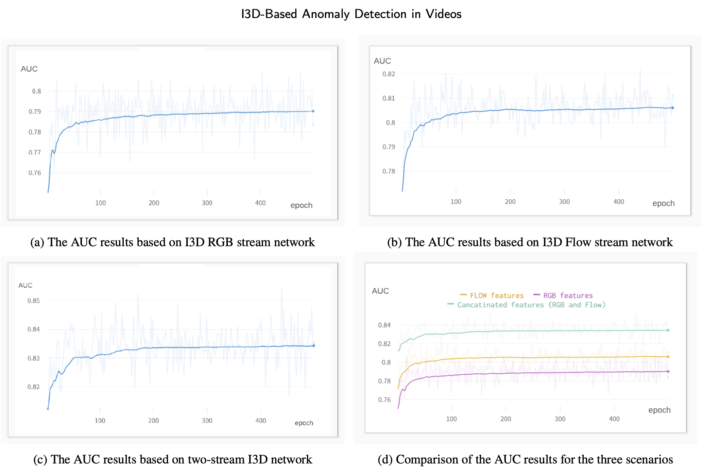
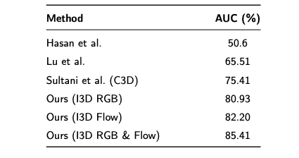

The rise of city-wide surveillance systems has led to a massive influx of video data aimed at enhancing public safety. This project tackles a central challenge in this domain: automatically detecting anomalous events in surveillance footage, where abnormal behaviors are rare, ambiguous, and context-dependent.

Traditional anomaly detection methods often assume that any deviation from a learned "normal" pattern signals an anomaly. However, this assumption oversimplifies real-world surveillance, where context is crucial—an event may be normal in one setting but suspicious in another.

To overcome this, I developed a weakly supervised anomaly detection model that minimizes reliance on manual annotations. Built on a Multiple Instance Learning (MIL) framework, the model treats each video as a bag of clips and learns to assign higher anomaly scores to clips likely containing abnormal events—without needing frame-level labels.

At the core of the system is a Two-Stream Inflated 3D (I3D) Convolutional Neural Network, which extracts both RGB (appearance) and optical flow (motion) features to capture the full spatiotemporal dynamics of video content. This two-stream architecture significantly outperforms traditional 3D CNNs (e.g., C3D), offering a more nuanced understanding of video context.

Additional contributions include:

- Demonstrating the impact of feature fusion (RGB + Flow) on model accuracy.

- Highlighting how training strategies, such as optimizer selection and learning rate tuning, influence detection performance.

The model was rigorously evaluated on the UCF-Crime dataset, achieving state-of-the-art results and validating the effectiveness of combining weak supervision with powerful feature extraction techniques. 

Quantitative comparison of anomaly detection methods on the UCF-Crime dataset.

